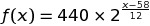
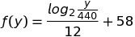

# Musical Application
## Within this repository:
* Musical note to Frequency (in Hz) Converter | notes.c

## How to use:
### notes.c
```c
// Example
#include "notes.c"

//...
main() {
  printf("%.2fHz\n", note("C0"));   // 16.35Hz
  printf("%.2fHz\n", note("Cb3"));  // 123.47Hz
  printf("%.2fHz\n", note("B##7")); // 4434.92Hz
  printf("%s\n", hz(440.00));       // "A4"
  printf("%s\n", hz(987.77));       // "B5"
  printf("%s\n", hz(2489.02));      // "D#7"
  printf("\n - Notas: -\n");
  listNotes(12);                    // List the first 12 notes
  system("PAUSE");
}
```

### How it works
Let x be the numeric value of the note and f(x) be the frequency in hertz (C as 0):



Let y be the frequency in hertz and f(y) be the numeric value of the note (B as 0):



Where 440Hz and 58 is the frequency and the numeric value(step), respectively, of A4, and 12 is the total number of notes in the chromatic scale.
 * Sharps (♯) and Flats (♭) **works** for *mi* and *si* - classic model (use ```#``` and ```b```)
 * Double-Sharps (𝄪) and Double-Flats (𝄫) **are** allowed (use ```##``` and ```bb```)
